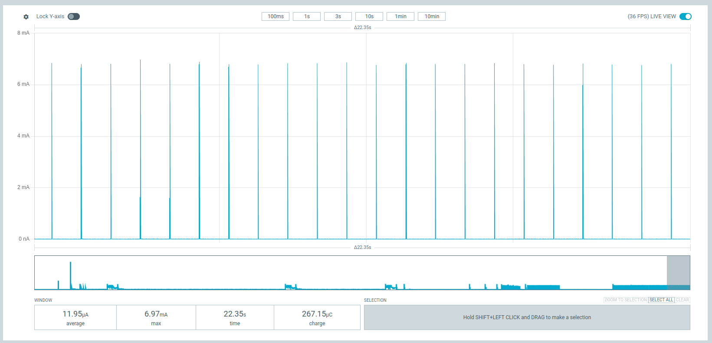

Simple example showing low power consumption w/ an nRF52-DK

Expect ~0.6uA in sleep, 140uA in connectable advertising, 12uA in non-connectable advertising (with default parameters).

Hit button 1 on the devkit to begin connectable advertising (it may take two presses, one to wake the DK)
Hit button 2 on the devkit to begin non-connectable advertising

  

